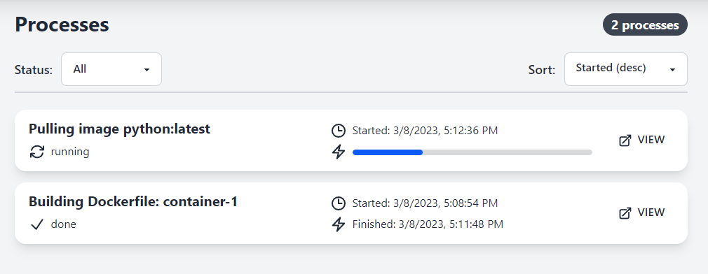
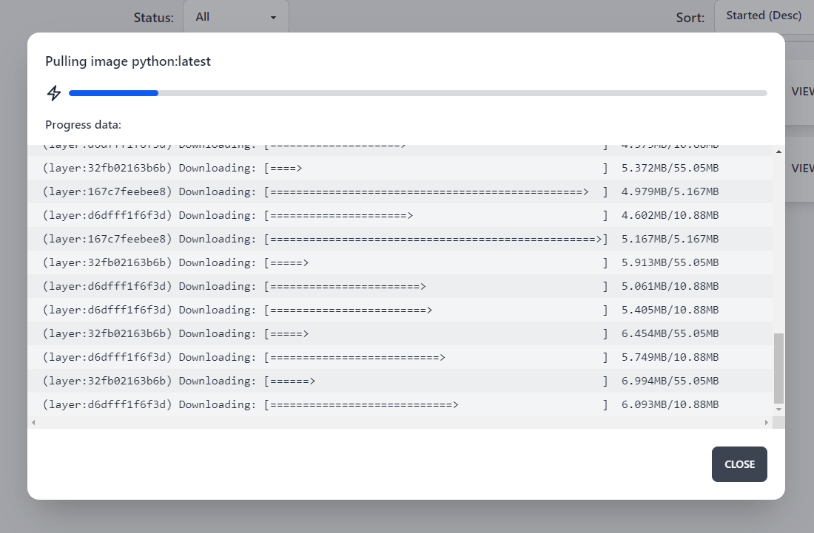

## Processes

When you start a task that can take a long time to complete, Light-Whale will add it to the **Processes** section.

Here you can see all the processes that are currently running and those that have already finished.

### Process details

To see details about a process, click on it.

You can see the process name, current progress, and detailed information.

