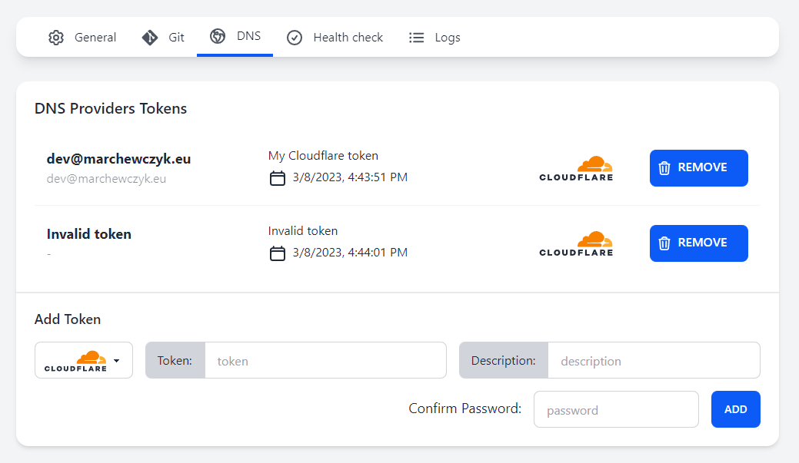
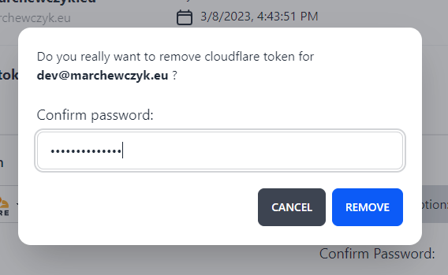
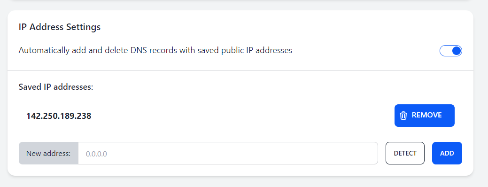

## DNS Settings

The "DNS" tab contains settings for DNS providers and IP addresses.

Here you can add tokens for DNS providers and configure automatic DNS updates.

Currently, Light-Whale supports the following DNS providers:
- [Cloudflare](https://www.cloudflare.com)
- [OVHcloud](https://www.ovhcloud.com)
- [DigitalOcean](https://www.digitalocean.com)

### Adding a token

1. To add a token, first **select the provider** you want to add a token for.
2. Then, **enter the token** (and username if required).
3. You can also add a description for the token.
4. Finally, **confirm the Light-Whale password** and click **Add**.

All your added tokens will be listed in the table.

If Light-Whale is unable to fetch token data, it will be visible as _Invalid token_.

### Deleting a token

1. To delete a token, click the **Remove** button next to the token you want to delete.
2. Then **confirm the Light-Whale password** and click **Remove**.

### Configuring automatic DNS updates

To enable automatic DNS records updates, enable the setting _Automatically add and delete DNS records with saved public IP addresses_.

If this setting is enabled, Light-Whale will automatically try to add and delete DNS records with the saved public IP addresses for the sites you create.

### Managing saved public IP addresses

To add a new public IP address, **enter the address** and click the **Add** button.

You can also try to automatically detect your public IP address by clicking the **Detect** button.

To delete a public IP address, click the **Remove** button next to the address you want to delete.

