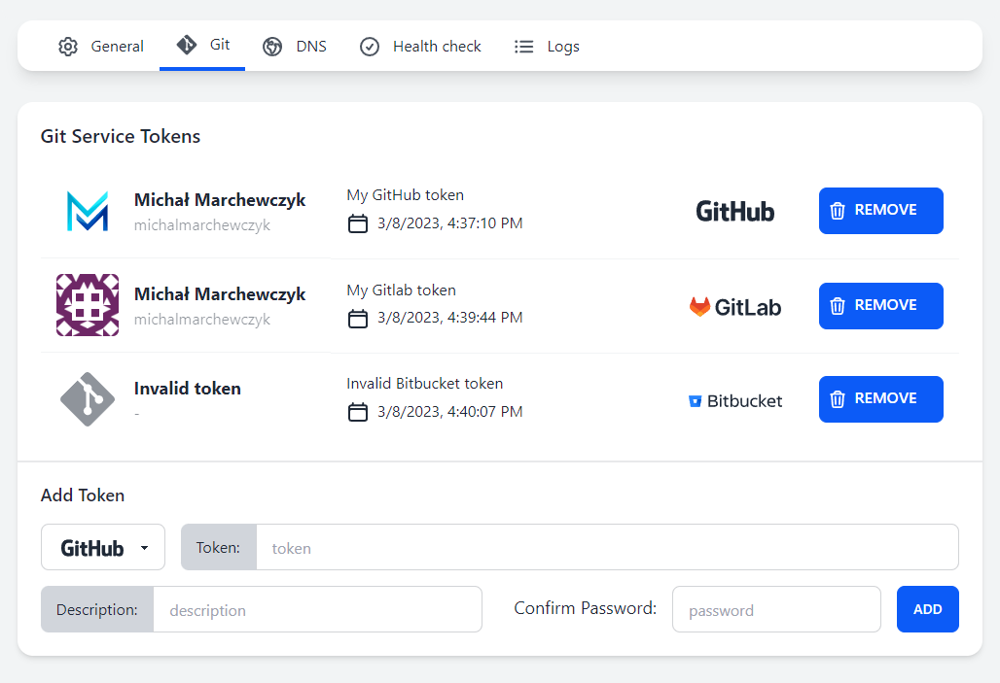
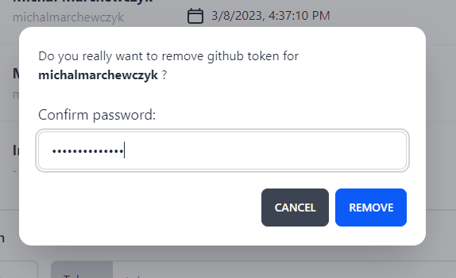

## Git Settings

The "Git" tab contains settings for Git services.

Here you can add tokens for Git services.

Currently, Light-Whale supports the following Git services:
- [GitHub](https://github.com)
- [GitLab](https://gitlab.com)
- [Bitbucket](https://bitbucket.org)
- [JetBrains Space](https://jetbrains.com/space)

### Adding a token

1. To add a token, first **select the service** you want to add a token for.  
2. Then, **enter the token** (and username if required).  
3. You can also add a description for the token.  
4. Finally, **confirm the Light-Whale password** and click **Add**.

All your added tokens will be listed in the table.

If Light-Whale is unable to fetch token data, it will be visible as _Invalid token_.

### Deleting a token

1. To delete a token, click the **Remove** button next to the token you want to delete.
2. Then **confirm the Light-Whale password** and click **Remove**.

