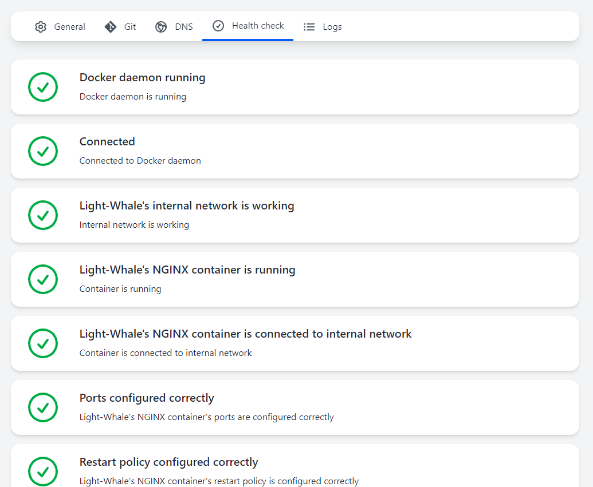
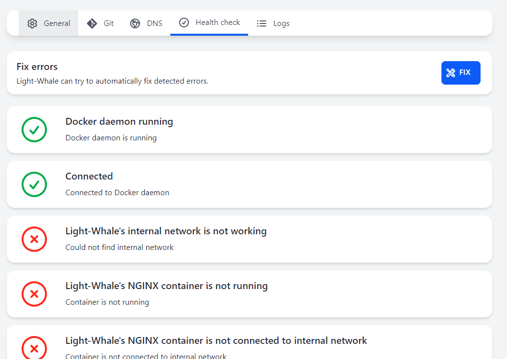

## Health check

The "Health check" tab contains information about the status of Light-Whale and its dependencies.

Here you can check if Light-Whale is running correctly and if all its dependencies are working.

#### Automatic fix

If Light-Whale detects a problem, that can be fixed automatically, it will offer to fix it.
To try to fix the problem, click the **Fix** button.

#### Descriptions of listed checks

| Check                                                       | Description                                                                      | Possible solutions                                                |
|-------------------------------------------------------------|----------------------------------------------------------------------------------|-------------------------------------------------------------------|
| Docker                                                      | Checks if Docker is running by running the `docker version` command              | Make sure Docker is installed and running                         |
| Connected                                                   | Checks if Docker Engine API is available at http://localhost:2375                | Make sure Docker Engine API is available at http://localhost:2375 |
| Light-Whale's internal network                              | Checks if Light-Whale's internal network is created                              | Automatic fix                                                     |
| Light-Whale's NGINX container                               | Checks if Light-Whale's NGINX container is created and running                   | Automatic fix                                                     |
| Light-Whale's NGINX container connected to internal network | Checks if Light-Whale's NGINX container is connected to internal network         | Automatic fix                                                     |
| Ports configurations                                        | Checks if Light-Whale's NGINX container is configured to expose ports 80 and 443 | Automatic fix                                                     |
| Restart policy                                              | Checks if Light-Whale's NGINX container has been configured to always restart    | Automatic fix                                                     |

