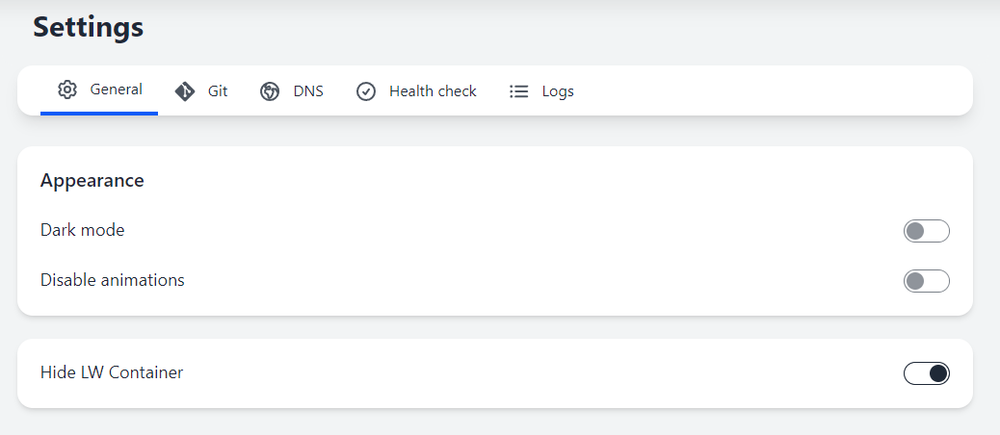
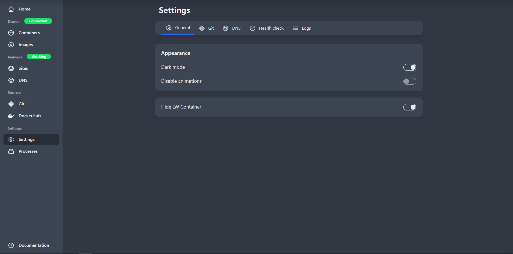

## Settings

In the **Settings** you can configure Light-Whale.

Settings are divided into several tabs:
- [General](#general-settings)
- [Git](/settings/git)
- [DNS](/settings/dns)
- [Health check](/settings/health-check)
- [Logs](/settings/logs)

### General settings

The "General" tab contains general settings for Light-Whale.

Here you can change how Light-Whale looks.

#### Dark mode

Enabling dark mode will change the color scheme of Light-Whale to a dark theme.

#### Disable animations

Enabling this option will disable all animations in Light-Whale.

#### Hide LW Container

Enabling this options will hide Light-Whale internal containers and images.

