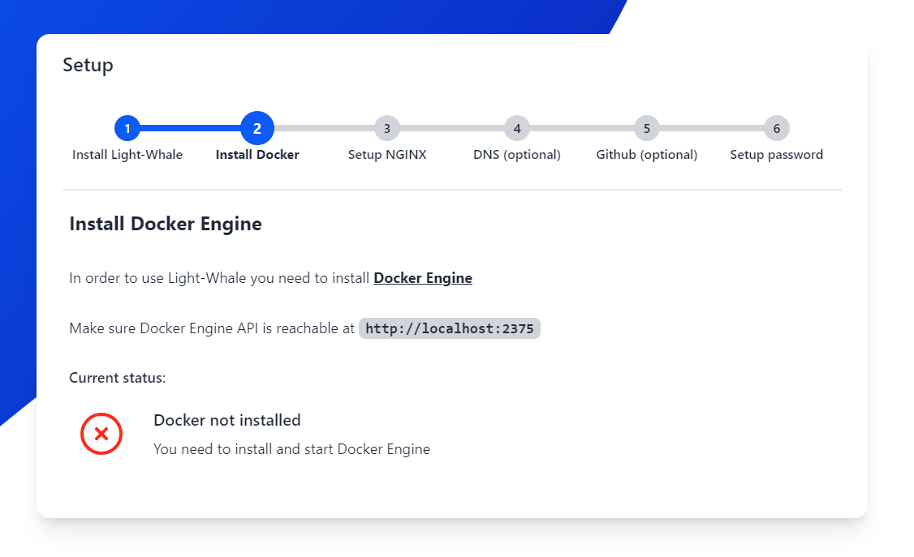
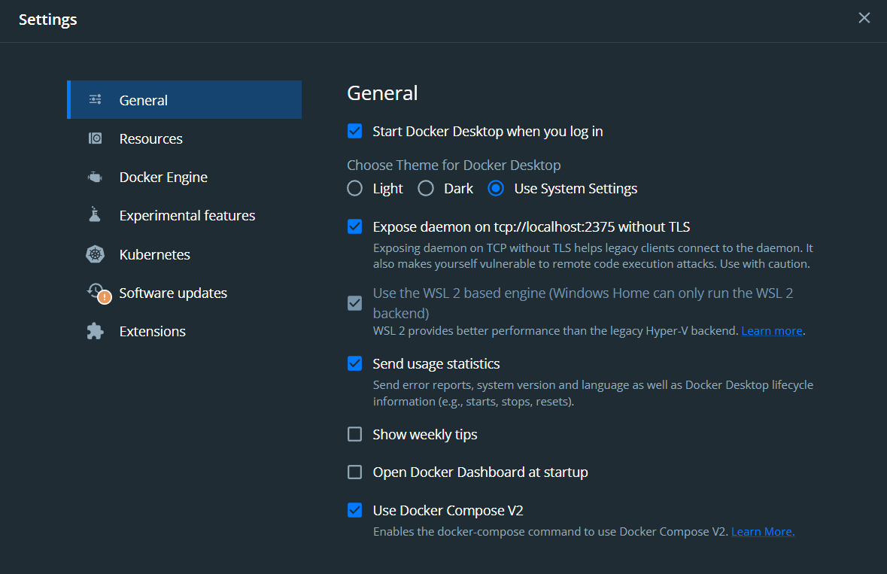
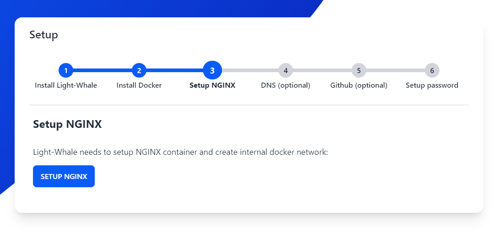
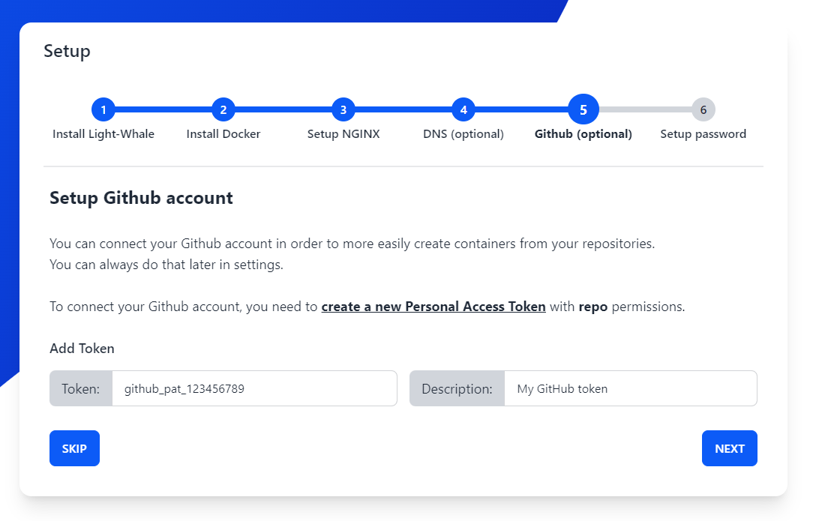
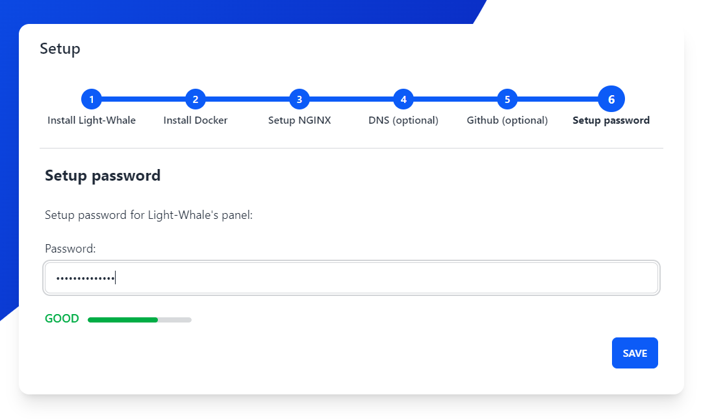

## Setup

After installing Light-Whale, you need to go through a quick setup process to get it up and running.
This will ensure all dependencies are installed and configured correctly.

### Step 1: Docker

#### Docker

Light-Whale uses Docker, Docker Compose and Docker Engine API.

You have to have Docker installed on your system, and the Docker daemon running.

You can find the installation instructions for your system here: [https://docs.docker.com/get-docker/](https://docs.docker.com/get-docker/)

#### Docker Engine API

Light-Whale uses the Docker Engine API to communicate with the Docker daemon.

You need to make sure that Docker Engine API is accessible on http://localhost:2375.

To enable Docker Engine API on Windows, you need to go to Docker dashboard settings, and enable the option *Expose daemon on tcp://localhost:2375 without TLS*.

**After completing these steps, setup will continue automatically.**

### Step 2: NGINX

In this step, Light-Whale will automatically setup its internal Docker components.

It will attempt to do the following:
- Download image the newest version of NGINX (nginx:latest)
- Use the NGINX image to create a container light-whale-nginx
- Configure the container to use the default port 80
- Create a network light-whale-network
- Connect the container to the network
- Start the container
- Setup default configuration for NGINX

**After completion, setup will continue automatically.**

### Step 3: DNS (optional)

### Step 4: GitHub (optional)

In this step you can connect your GitHub account using a [personal access token](https://docs.github.com/en/authentication/keeping-your-account-and-data-secure/creating-a-personal-access-token)

You can always do this later in the settings.

### Step 5: Password

To finish the setup process, you need to set a password for Light-Whale.

**After correctly setting the password, setup will finish and you will be redirected to the login page.**
